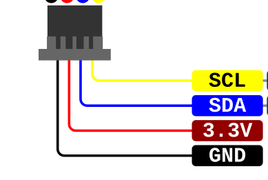

# Accelerometer Shock Detection

The ADXL343 and ADXL375 libraries do not currently include shock-detection support, so I may as well implement it.

These accelerometers are related devices with similar interfaces, but their measurement ranges and intended applications differ.

## Datasheets

* [ADXL343 Datasheet](https://www.analog.com/media/en/technical-documentation/data-sheets/adxl343.pdf)
* [ADXL356, ADXL357, and ADXL357B Datasheet](https://www.analog.com/media/en/technical-documentation/data-sheets/adxl356-357-357b.pdf)

## qwiic connector wire diagram

 

## Limitations

* I2C communication limits sampling to approximately 200 Hz.
* SPI supports sampling rates up to 3200 Hz.
* Data framing differs between I2C and SPI.
* The framing may also depend on the configured sampling frequency.

For example, if an SPI device is operating at 1600 Hz and the sample rate is increased to 3200 Hz, the receiving code may also need to adjust its framing and timing.

## Existing Libraries

* [Adafruit ADXL375 Library](https://github.com/adafruit/Adafruit_ADXL375)
* [Adafruit ADXL343 Library](https://github.com/adafruit/Adafruit_ADXL343)

## Goal

The goal is to add shock-detection support while accounting for:

* Device-specific measurement ranges
* I2C and SPI communication differences
* Configurable sampling frequencies
* Data framing and buffering requirements
* Shock thresholds and event duration
* Peak acceleration capture

