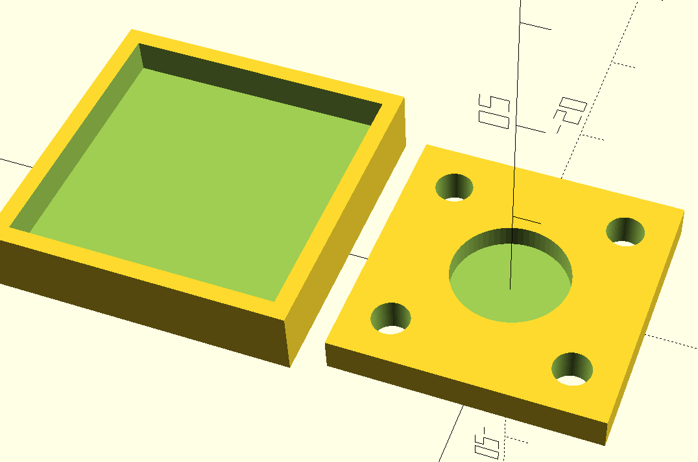
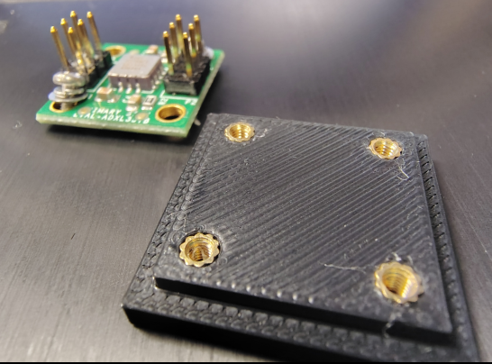
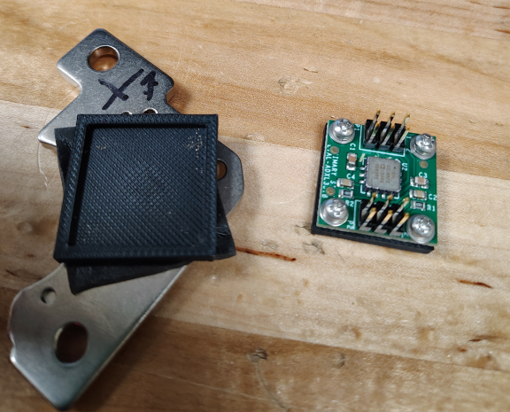
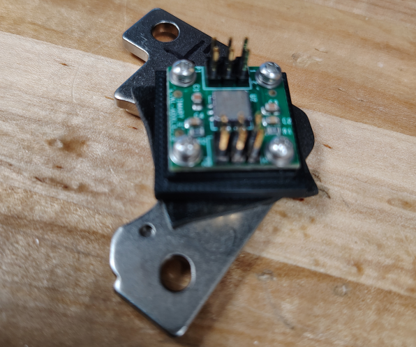
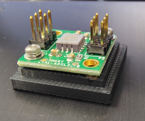

# ADXL357BZ Sensor mount and compressor baracket
<pre>
Concept: The Compressor bracket stays on the comprressor, such that repeatable tests
         or repeatable sensor placement is possible.
         
The sensor mounts to a plate that seats into a holder magneticaly stuck to the compressor.
X,Y orientation maters. For convention, X,Y may be labled on the holder. 
</pre>

